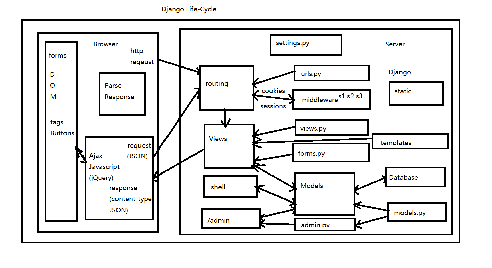

# Personal Page Stories
> Here are stories about creating my personal page using Django, codes apply to Django 3.1.4 


## Basic Django Structure



## Content

* [Initiate Project](#initiate)
  - [Start a New Project](#start)
  - [Config the Django Project](#config-p)
    - [Static files](#static)
    - [Secret Key](#secret)
* [Front-end](#front)
  - [Config Template Settings](#config-t)
  - [Download Bootstrap and jQuery to Local](#b-and-j)
  - [Create General Templates](#templates)
    - [Base Bootstrap](#base-boostrap)
    - [Base Page](#base-page)
* [Back-end](#back)


<a id="initiate"></a>
## Initiate Project


<a id="start"></a>
### Start a New Project

* Create a github repo, edit .gitignore
* Create virtual environment, mine:
  - `virtualenv -p python3.7 .venv`
  - `source .venv/bin/activate`
  - `pip install django`
  - `pip freeze > requirments.txt`
* Create new project called 'mysite': 
  - `Django-Admin startproject mysite`
  - move the inside project folder to github folder if you like
  - `python manage.py check`
* Create first home app:
  - `python manage.py startapp home`
* First migrate to start the project: 
  - `python manage.py migrate`
  - in settings `INSTALLED_APPS` add `'home.apps.HomeConfig',`
    

<a id="config-p"></a>
### Config the Django Project


<a id="static"></a>
#### Static files

* [Django Document for Static Files](https://docs.djangoproject.com/en/3.1/howto/static-files/) as this may change as version evolves
* In settings.py, add `STATIC_URL = '/static/'`
* set static directories like:
  - ```python
    STATICFILES_DIRS = (
    os.path.join(BASE_DIR, 'utils/static/'),
    os.path.join(BASE_DIR, 'home/templates/home/home_js/'),
    )```
* set a static root for server end, for me: `STATIC_ROOT = 'static'`
* set static url, according to Django document, in mysite/urls.py, add `urlpatterns += static(settings.STATIC_URL, document_root=settings.STATIC_ROOT)`
* collect static files in static directories to server-side static root by: `python manage.py collectstatic`


<a id="secret"></a>
### Secret Key
> The secret key is used for:
> * All sessions if you are using any other session backend than django.contrib.sessions.backends.cache, or are using the default get_session_auth_hash().
> * All messages if you are using CookieStorage or FallbackStorage.
> * All PasswordResetView tokens.
> * Any usage of cryptographic signing, unless a different key is provided.
> 
> * [reference](https://www.cnblogs.com/cpl9412290130/p/10431514.html)

* In settings, config `SECRET_KEY` to `os.environ["DJ_SECRET_KEY"]`
* In linux, do `export DJ_SECRET_KEY="xxxxxxxx"`, if not a server you can store it in rc
* In windows, do `$env:DJ_SECRET_KEY="xxxxxxxx"`, and if not a server you can store commends in `$profile` for powershell


<a id="front"></a>
## Front-end


<a id="config-t"></a>
### Config Template Settings

* Create ctx_processor.py and give:
  - ```python
    from django.conf import settings as django_settings
    
    def settings(request):
      return {
          'settings': django_settings,
      }
    ```
* go to settings and add `'mysite.ctx_processor.settings',` to list `TEMPLATES`


<a id="b-and-j"></a>
### Download Bootstrap and jQuery to Local
> In this project I use Bootstrap v5.0.0-beta1 and jQuery 3.5.1
> It is also common to use React and Vanilla Javascript in front-end

* Download Boostrap and jQuery, 
* `mkdir utils`
* Copy the files to utils
* put utils folder in `STATICFILES_DIRS`
* collect


### Creating General Templates
> I create Django templates using bootstrap and jQuery


#### Base Bootstrap
> base_boostrap.html\
> First layer, just to import utils and create big structure

* According to [Django Document for Static Files](https://docs.djangoproject.com/en/3.1/howto/static-files/), ``
* Load first static resources
* In `<body>`, create needed blocks like ` `, ` ` ` `
* Some extra blocks: welcome, messages(alert)


<a id="base-page"></a>
#### Base Page
> base_page.html \
> Second layer, basically implementing the navbar and footer \
> For overall functionalities across the site \
> Also implementing Ajax in this page
