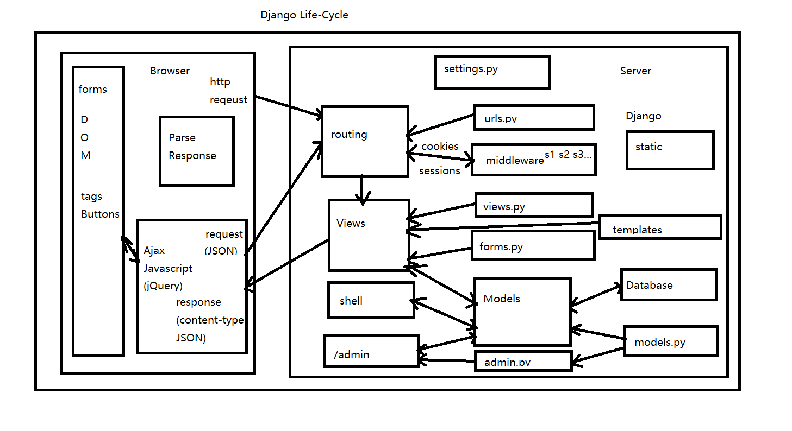
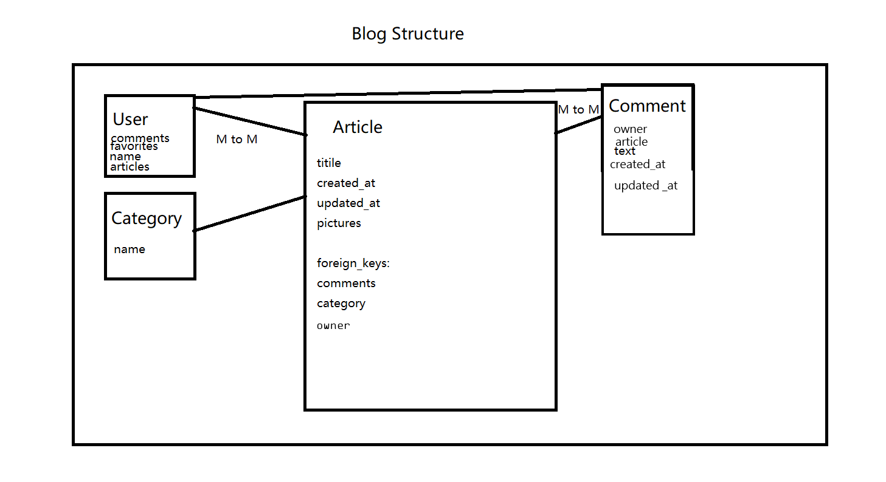

# Personal Page Stories
> Here are stories about creating my personal page using Django, codes apply to Django 3.1.4 


## Basic Django Structure



## Content

* [Initiate Project](#initiate)
  - [Start a New Project](#start)
  - [Config the Django Project](#config-p)
    - [Static Files](#static)
    - [Media Files](#media)
* [Front-end](#front)
  - [Add Crispy Forms](#crispy)
  - [Config App Settings](#config-a)
  - [Config Template Settings](#config-t)
  - [Download Bootstrap and jQuery to Local](#b-and-j)
  - [Create General Templates](#templates)
    - [Base Bootstrap](#base-boostrap)
    - [Base Page](#base-page)
        - [Build Ajax](#ajax)
  - [Authentication System Front-end](#auth-front)
    - [User Sign-up Front-end](#sign-up-front)
  - [Create Home Page](#home-page)
  - [Create Blog Templates](#blog-templates)
* [Back-end](#back)
  - [Authentication System Back-end](#auth-back)
    - [User Sign-up Back-end](#sign-up-back)
  - [Home Page Back-end](#home-back)
  - [Blog Back-end](#blog-back)
    - [Create Blog Model](#blog-models)
    - [Create Blog  Forms](#blog-form)
    - [Create Blog Views](#blog-views)
    - [Create Blog Urls](#blog-urls)
* [Deployment](#deploy)
  - [Secret Key](#secret)
  - [Config Deployment Settings](#config-d)
  - [Config Raw Server](#server)
    - [Config Uwsgi and Docker](#uwsgi)
    - [Config Nginx and Docker](#uwsgi)
    - [Start Server](#start-server)


<a id="initiate"></a>
## Initiate Project


<a id="start"></a>
### Start a New Project

* Create a github repo, edit .gitignore
* Create virtual environment, mine:
  - `virtualenv -p python3.7 .venv`
  - `source .venv/bin/activate`
  - `pip install django`
  - `pip freeze > requirments.txt`
* Create new project called 'mysite': 
  - `Django-Admin startproject mysite`
  - Move the inside project folder to github folder if you like
  - `python manage.py check`
* Create first home app:
  - `python manage.py startapp home`
* First migrate to start the project: 
  - `python manage.py migrate`
  - In settings `INSTALLED_APPS` add `'home.apps.HomeConfig',`
    

<a id="config-p"></a>
### Config the Django Project


<a id="config-a"></a>
#### Config App Settings

* Config the `APP_NAME` to the webpage name


<a id="static"></a>
#### Static files

* [Django Document for Static Files](https://docs.djangoproject.com/en/3.1/howto/static-files/) as this may change as version evolves
* In settings.py, add `STATIC_URL = '/static/'`
* Set static directories like:
  - ```python
    STATICFILES_DIRS = (
    os.path.join(BASE_DIR, 'utils/static/'),
    os.path.join(BASE_DIR, 'home/templates/home/home_js/'),
    )```
* Set a static root for server end, for me: `STATIC_ROOT = 'static'`
* Set static url, according to Django document, in `mysite/urls.py`, add `urlpatterns += static(settings.STATIC_URL, document_root=settings.STATIC_ROOT)`
* Collect static files in static directories to server-side static root by: `python manage.py collectstatic`


<a id="media"></a>
#### Media Files

* [reference](https://www.cnblogs.com/harryTree/p/11865900.html)
* [reference for url](https://stackoverflow.com/questions/36280056/page-not-found-404-django-media-files)
* Config `MEDIA_ROOT = os.path.join( BASE_DIR  ,  "media"  )`
* Config `MEDIA_URL = '/media/`
* In `mysite/url.py`, put `urlpatterns += static(settings.MEDIA_URL, document_root=settings.MEDIA_ROOT)`
* Add `media/` to `.gitignore`
* Add `'django.template.context_processors.media',` to `TEMPLATE`


<a id="front"></a>
## Front-end


<a id="crispy"></a>
### Add Crispy Forms 

> Just for better forms

* `pip install django-crispy-forms`
* `pip freeze > requirments.txt`
* add `'crispy_forms',` in `INSTALLED_APPS`
* add `CRISPY_TEMPLATE_PACK = 'bootstrap4'` to settings


<a id="config-t"></a>
### Config Template Settings

* Create ctx_processor.py and give:
  - ```python
    from django.conf import settings as django_settings
    
    def settings(request):
      return {
          'settings': django_settings,
      }
    ```
* Go to settings and add `'mysite.ctx_processor.settings',` to list `TEMPLATES`


<a id="b-and-j"></a>
### Download Bootstrap and jQuery to Local

> In this project I use Bootstrap v4.5.3 and jQuery 3.5.1
> It is also common to use React and Vanilla Javascript in front-end

* Download Boostrap and jQuery, 
* `mkdir utils`
* Copy the files to utils
* Put utils folder in `STATICFILES_DIRS`
* Collect


### Creating General Templates

> I create Django templates using bootstrap and jQuery


#### Base Bootstrap

> base_boostrap.html\
> First layer, just to import utils and create big structure

* According to [Django Document for Static Files](https://docs.djangoproject.com/en/3.1/howto/static-files/), ``
* Load first static resources
* In `<body>`, create needed blocks like ` `, ` ` ` `
* Some extra blocks: welcome, messages(alert)


<a id="base-page"></a>
#### Base Page

> base_page.html \
> Second layer, basically implementing the navbar and footer \
> For overall functionalities across the site \
> Also implementing Ajax in this page \
> [reference](https://codepen.io/joycousc/pen/RwrVBYe)


##### Navbar

* [Bootstrap Document](https://getbootstrap.com/docs/4.5/components/navbar/)
* Should use from settings for app name and urls
* Should use `class="navbar-toggler"` and `class="collapse navbar-collapse justify-content-end"` for navbar-toggle for mobile devices
* Should `fixed-top`


##### Header

* Should retain space for navbar 


##### Footer

* Should include a footer at the bottom in the ``
* Should include copy right html entity and some external links to other personal spaces


<a id="ajax"></a>
##### Build Ajax
* Should put the ajax javascript in base_static/base_js folder and then add the root to `STATICFILES_DIRS`
* Should import js from static
* Implementing Ajax using jQuery
* Give the DOM ajax object with ajax functions after loading the page
* [base.js](../home/templates/base_static/base_js/base.js)


<a id="auth-front"></a>
### Authentication System Front-end

> The authentication system view will be created automatically by Django \
> The authentication system view will be created automatically by Django \
> since I'm using the Django built-in authentication 
> Already created account app in back-end


<a id="sign-up-front"></a>
#### User Sign-up Front-end


* Create [account/templates/registration/signup.html](../account/templates/registration/signup.html)
* Extends `base_page.html`
* Loop through the fields in the form provided by back end
* Display error in red each loop


#### User Login Template

* Extends Base Page
* [django document](https://docs.djangoproject.com/en/3.1/topics/auth/default/)
* Create [account/templates/registration/login.html](../account/templates/registration/login.html)
* Should add [csrf token](https://docs.djangoproject.com/en/3.0/ref/csrf/) in each form
* Should add create account button


<a id="home-page"></a>
### Create Home Page

* Should include static file directory home_static
* Should include Education session
* Should include Experience session
* Should include Hobbies session


#### Write Home Details

* Should have Details for Education, Experience, Hobbies in 3 other templates


<a id="blog-templates"></a>
### Create Blog Templates


#### Create Blog Base Template

* [blog_base.html](../blog/templates/blog_base.html)
* Should have a side bar
* Should have `blog_staic` folder for static files and config to `STATICFILES_DIRS`
* Put needed js script in [blog_base.js](../blog/templates/blog_base_static/blog_base_js/blog_base.js) in `blog_base_js`
* Set the 'Blog' button on `base_page.html` to the blog `base` url
* After based page loaded, load article list to `blog-content`
* Items in the side bar should include displaying articles in each category, and a sign-in button


#### Create Article List Template

* [article_list.html](../blog/templates/blog/article_list.html)
* Loads the `article_list` given by the View
* Display only first 100 characters of text using `{{ article|slice:":100" }}`
* Should display fields: owner, updated_at, category
* Should have choice of adding and removing to favorites
* Should have choice of updating and deleting for the owners
* Each Article should have a "Read More" Button to generate the full article detail to `blog-conent`


#### Create Article Detail Template

* In [blog/article_detail.html](../blog/templates/blog/article_detail.html), display details of the article
* Should include title, text, picture on the side 
* Should display created_at, updated_at, category
* Should have choice of adding and removing to favorites
* Should have choice of updating and deleting for the owners
* Each Should have form for comments (should only display after user login)
* Should have choice to delete comments


#### Create Article Form Template

> Since I'm building a one-page application, I'm using jQuery ajax to send post request \
> instead of using the default submit

* In [blog/article_form.html](../blog/templates/blog/article_form.html)
* Display form to create and update an Article
* In [blog_base.js](../blog/templates/blog_base_static/blog_base_js/blog_base.js), implement ajax post method using jQuery
* In progress, fixed a bug about uploading file using ajax
  1. Preventing a form to redirect to new page, `event.preventDefault()` is needed
  2. FormData is needed for files to be uploaded by ajax, we should use append with FormData
  3. `processData: false, contentType: false, cache: false,` is need in the `ajax` function of jQuery for uploading files
  4. `enctype='multipart/form-data'` is needed in the forms with file
  5. `name` of file appended to the FormData should **match** the name in the form otherwise it won't be recognized by `is_valid` function of the form


#### Create Article Confirm Delete Template

* [blog/article_confirm_delete.html](../blog/templates/blog/article_confirm_delete.html)
* The template receives a form from back-end
* The template should use ajax to send post


<a id="back"></a>
## Back-end


<a id="auth-back"></a>
### Authentication System Back-end


#### About Superuser

> Right now I'm using the Django built-in admin site for convenience
> It's because if I'm building my own, it's going to be thousands of extra lins of code
> and mostly it;s going to be functionally homogeneous to the built-in one

* Add `'django.contrib.admin',` to `INSTALLED_APPS`
* Add `path('admin/', admin.site.urls),` to `mysite/urls.py`
* Create a superuser by `python manage.py createsuperuser`
* Delete a superuser by:
  - ```
    > django-admin.py shell
    $ from django.contrib.auth.models import User
    $ User.objects.get(username="joebloggs", is_superuser=True).delete()
    ```


#### Start Account App

* `python manage.py startapp account`
* Include account in `mysite/urls.py` and `INSTALLED_APP`
* Include SignUp in [account/urls.py](../account/urls.py)


#### Add Authentication Back-end Features

> I'm using the Django built in authentication system as well since A complete, safe authentication is 
> very time-consuming to build, and the Django authentication system is right now capable of fulfilling my needs
  
* Add authentication urls to [account/url.py](../account/urls.py)


<a id="sign-up-back"></a>
#### User Sign-up Back-end

> Somehow the Django Built-in system doesn't support a sign-up page \
> Therefore I'm building my own by creating an account app
> [reference](https://simpleisbetterthancomplex.com/tutorial/2017/02/18/how-to-create-user-sign-up-view.html)


### Profile Model

> Creating for using profile gives more flexibility to future functionalities \
> I'm doing this by extends User model with OneToOneField \
> [reference](https://simpleisbetterthancomplex.com/tutorial/2016/07/22/how-to-extend-django-user-model.html)

* [models.py](../account/models.py)
* Import User model and `post_save` and a `receiver` dispatch


### Account Form

* [forms.py](../account/forms.py)
* Customize the form in `forms.py` by creating `SignUpForm`


### Account Views

* Import the built-in `UserCreationForm`
* Should have class SignUp


<a id="home-back"></a>
### Home Page Back-end

* Should have an url and a view to just render main.html


<a id="blog-back"></a>
### Blog Back-end


<a id="blog-models"></a>
#### Create Blog Model


* `python manage.py startapp blog`
* Add new app in settings
* [models.py](../blog/models.py)
* Follow the structure of blog,  for example `class Category(models.Model):`
* For pictures(single picture for now), use `picture = models.FileField(upload_to="article_pic")`
* Each model should implement `__str__` for showing in admin
* `favorites` and `comments` field in `Article` class should be `models.ManyToManyField`
* Should have `Favorite` and `Comment` helper Many-To-Many class for comments and favorites
* Add `Category` and `Article` class to [admin.py](../blog/admin.py)
* `python manage.py makemigrations`, `python manage.py migrate`


##### Limit the File Uploaded


[reference](https://zhuanlan.zhihu.com/p/79289488)
* Add [blog/fields.py](../blog/fields.py)
* Override `FileField` with extra arguments `content_types` and `max_upload_size`, and the clean method
* Use it in the model
* How to upload multiple files


<a id="blog-form"></a>
#### Create Blog Forms

* In [blog/forms.py](../blog/forms.py), create for `ArticleForm` for Articles and `CommentForm` for Comments


<a id="blog-views"></a>
#### Create Blog Views

* [views.py](../blog/views.py)
* Should have [owners.py](../blog/owners.py) to override generic views
* Should include `BlogBaseView`,`ArticleListView`, `ArticleDetailView`
* 'ArticleListView' Should return list of articles
* At the same time `ArticleListView` should listen for the `search` and `category_id` for search function and category article list
* Should include `ArticleCreateView`, `ArticleUpdateView`, `ArticleDeleteView`
* For `ArticleCreate`, `ArticleUpdate` views, use `LoginRequiredMixin` to require user to login to access the view, remember to put the mixin in the first place
* For ajax purposes `ArticleCreateView` and `ArticleUpdateView` views should use View class to feed response by myself
* Because of DRY principle both `ArticleCreateView` and `ArticleUpdateView` view should use [blog/article_form.html](../blog/templates/blog/article_form.html) as template
  - Pass in `form_action` for front-end form to know the action of form
* Should include `page_obj` for paginator, for Django paginator, [reference](https://docs.djangoproject.com/en/3.1/topics/pagination/)
* In `ArticleDeleteView`, use `OwnerDeleteView`
* Should have `CommentCreateView` and `CommentDeleteView`.
  - `CommnetCreateView` should take the article's `pk` and add Comment to db
  - `CommentDeleteView` should take `pk`(comment id) as parameter, use `LoginRequereMixin` and delete comment from db
* Should have `AddFavoriteView` and `DeleteFavoriteView` for users to add or delete favorite articles
* `ArticleListView` Should include a search parameter lookup to return searched articles by both title and text
* For multiple search, it is recommended to use `Q` to make queries

<a id="blog-urls"></a>
#### Create Blog Urls

* [urls.py](../blog/urls.py)
* Should include a base url
* `app_name` blog
* Should include blog urls in `mysite/urls.py`, like `path('blog', include('blog.urls')),`
* Should include `base`, `article_list`, `article_create`
* Should include `category_detail`, `article_detail`, `article_update`, `article_delete` with `pk` as a parameter
* Should include `comment_create`, and `comment_delete` with parameters `pk` with meaning of article id and comment id
* Should include `article_favorite` and `article_unfavorite` with parameters `pk`


<a id="deploy"></a>
## Deployment


<a id="secret"></a>
### Secret Key

> The secret key is used for:
> * All sessions if you are using any other session backend than django.contrib.sessions.backends.cache, or are using the default get_session_auth_hash().
> * All messages if you are using CookieStorage or FallbackStorage.
> * All PasswordResetView tokens.
> * Any usage of cryptographic signing, unless a different key is provided.
> * [reference](https://www.cnblogs.com/cpl9412290130/p/10431514.html)

* In settings, config `SECRET_KEY` to `os.environ["DJ_SECRET_KEY"]`
* In linux, do `export DJ_SECRET_KEY="xxxxxxxx"`, if not a server you can store it in rc
* In windows, do `$env:DJ_SECRET_KEY="xxxxxxxx"`, and if not a server you can store commends in `$profile` for powershell


<a id="config-d"></a>
### Config Deployment Settings

* Config the `ALLOWED_HOST` by adding `['*']`
* Turn the `DEBUG` to `DEBUG = env('DJANGO_DEBUG', default=False)`


<a id="server"></a>
### Config Raw Server
> Using docker uwsgi and nginx containers structure to build the server side Structure \
>  personal-page \
 ├── compose \
 │   ├── nginx \
 │   │   ├──  Dockerfile # nginx \
 │   │   ├──  log # for nginx logs \
 │   │   ├──  nginx.conf \
 │   │   ├──  ssl # https \
 ├── db.sqlite3 \
 ├──  Dockerfile # for uwsgi \
 ├── manage.py \
 ├── mysite \
 │   ├── asgi.py \
 │   ├── __init__.py \
 │   ├── settings.py \
 │   ├── urls.py \
 │   └── wsgi.py \
 ├── requirements.txt # include：django==3.1.4 uwsgi==2.0.19 \
 ├── start.sh # or Makefile \
 └── uwsgi.ini # uwsg config


<a id="uwsgi"></a>
#### Config Uwsgi and Docker

* Add uwsgi to [requirements.txt](../requirements.txt)
* Add [start.sh](../start.sh)
* Add [uwsgi.ini](../uwsgi.ini)
* Add [Dockerfile](../Dockerfile)


<a id="nginx"></a>
#### Config Nginx and Docker

* Add [nginx/Dockerfile](../compose/nginx/Dockerfile)
* Add [nginx/nginx.conf](../compose/nginx/nginx.conf)


<a id="start-server"></a>
#### Start Server

* Use ssh or something to login to server, mine is Centos7
* **Optional, not needed if using docker** [Install python3.7](https://tecadmin.net/install-python-3-7-on-centos/)
* **Optional, not needed if using docker** [Install pip](https://www.liquidweb.com/kb/how-to-install-pip-on-centos-7/)
* [Centos7 install docker](https://docs.docker.com/engine/install/centos/)
* `sudo yum install git` and clone project from git repo
* Building image by going to the project folder in server and `sudo docker build -t pp_img:v1 .`
* `sudo docker images` to look at local images
* `sudo docker run -it --name personal-page \
  -p 8000:8000 \
  -v /root/TeamGH/personal-page:/var/www/html/personal-page \
  -d pp_img:v1`
  - `-it` means running interactively and have a pseudo TTY
  - named the container as personal-page
  - `-p` means port
  - `-d` means running in background
  - `-v` means linking the root in server and link root in container
* Use  `sudo docker exec -it personal-page /bin/bash` to enter the bash
* `export` the `DJ_SECRET_KEY` in the container
* **Optional, not needed if use uWSGI** `python manage.py migrate`, `python manage.py runserver 0.0.0.0:8000` and go to ip, then we can see the page is running
* `sh start.sh` or `sudo docker exec -it personal_page /bin/bash start.sh` one time
* `chown www-data:www-data .` and `chown www-data:www-data ./db.sqlite3` for users to access database
* Go to nginx directory and `sudo docker build -t nginx_img:v1 .`
* Run the nginx container by `sudo docker run -it -p 80:80 --name personal-page-nginx \
 -v /root/TeamGH/personal-page/static:/usr/share/nginx/html/static \
 -v /root/TeamGH/personal-page/media:/usr/share/nginx/html/media \
 -v /root/TeamGH/personal-page/compose/nginx/log:/var/log/nginx \
 -d nginx_img:v1`
* `docker exec -it personal-page-nginx /bin/bash` to go to nginx container
* `chown -R www-data:www-data /usr/share/nginx/` for uploading files
